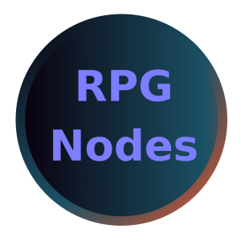

# RPGNodes [WIP]

[Work In Progress] RPGNodes es un addons que facilita la lógica para crear juegos RPG a través de nodos personalizados.

## Resumen

RPGNodes es una solución genérica a la lógica que presentan los juegos RPG.

Por ejemplo: Con el nodo RPGCharacter podrá representar la lógica de un personaje, como podría ser el añadirle experiencia. Con el nodo RPGItem podrá representar un item del juego, tiene todas las características comúnes de un item (item_name, description, amount, buy_price, sell_price, etc.)

## Estado del proyecto

El proyecto es poco usable ya que hay nodos que no estan terminados, la gran mayoría.

 **RPGCharacter:** Testeado!! (Muy Usable)

 **RPGDialog:** No Usable

 **RPGInventory:** No Usable

 **RPGItem:** No Usable

 **RPGStats:** No Usable

 **RPGWeightInventory:** No Usable

 **RPGSlotInventory:** No Usable

## Instalación y uso

### Deseo testear el plugin

Para testear el plugin usted puede clonar el repositorio y abrirlo con **Godot 4.2.x**.

### Deseo usar el plugin en un proyecto

Para usar el plugin en un proyecto requiere hacer los siguientes pasos:

1) Descargar o clonar el proyecto.

2) Copiar la carpeta addons del proyecto descargado y añadir esa carpeta en la raiz de su proyecto actual.

3) Abrir el editor y activar el plugin en **proyectos >> ajustes del proyecto >> plugins**

## Nodos personalizados

A continuación se describira el uso de los nodos personalizados, si tiene dudas del funcionamiento de algún método puede levantar un issue de github o puede consultar el código fuente del respectivo nodo que esta utilizando. Los métodos estan en inglés pero los comentarios en español.

### RPGCharacter

TODO

### RPGDialog

TODO

### RPGInventory

TODO

### RPGWeightInventory

TODO

### RPGItem

TODO

### RPGStats

TODO
