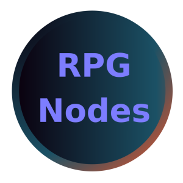

# RPGNodes

**RPGNodes** is an addon that simplifies logic for building RPG games using custom nodes.

## Summary

RPGNodes provides a generic solution for the typical logic found in RPGs.  
For example:

* **`RPGCharacter`** can represent a character’s logic – adding experience, health, energy or mana.
* **`RPGItem`** or **`RPGWeightItem`** represents an item with common attributes (item_name, description, amount, buy_price, sell_price, etc.).
* **`RGPWeightInventory`** stores and manages items that have weight, meaning each item can have a different weight.

## Project Status

The project is production-ready with comprehensive inventory management, character systems, and robust testing coverage.  
Unit tests are written with [GUT](https://github.com/bitwes/Gut/).

### Production Ready Features

 **RPGCharacter:** Production-ready – tested with unit tests (GUT) and enhanced with serialization support!

 **RPGDialog:** Usable – tested in a scene within the project.

 **RPGWeightItem:** Production-ready and tested together with `RPGWeightInventory` using unit tests (GUT).

 **RPGWeightInventory:** Production-ready and tested with unit tests (GUT).

 **RPGSlotInventory:** Production-ready – complete grid-based inventory system with comprehensive tests (GUT)!

 **RPGStats:** Production-ready – full character stat management with allocation system and extensive tests (GUT)!

### Supporting Classes

**RPGSlotItem** Functional companion for slot-based inventories.

**RPGActor** Abstract base class for actor-like entities.

**RPGEnemy** Specific implementation for enemy characters.

## Installation & Usage

We recommend downloading the latest release from GitHub:  
[https://github.com/TheVulcoreTeam/RPGNodes/releases](https://github.com/TheVulcoreTeam/RPGNodes/releases)

### Want to test the plugin?

Clone the repository and open it with **Godot 4.5.x**.  
If you actually want to use it, it’s best to download the released version from GitHub.

### Want to use the plugin in a project?

Using the plugin requires the following steps:

1. Download the release:  
   <https://github.com/TheVulcoreTeam/RPGNodes/releases>
2. Copy the `rpg_nodes` folder and place it inside your project's `addons` directory. If you don’t have an `addons` folder at the root of your project, create one.
3. Open Godot’s editor and enable the plugin under  
   **Project → Project Settings → Plugins**

## What's New in v0.10.0

This major release transforms RPGNodes from a promising toolkit into a production-ready RPG framework:

* **Complete Dual Inventory Systems**: Choose between weight-based or Diablo-style slot-based inventories
* **Production-Ready Stats System**: Full character stat management with point allocation
* **Enhanced Architecture**: Better inheritance with proper base classes (RPGActor, RPGNode)
* **Comprehensive Testing**: Extensive unit test coverage for all new features
* **Serialization Support**: Save/load functionality for critical systems

## Choosing the Right Inventory System

RPGNodes now offers two complete inventory solutions:

### Weight-Based Inventory (`RPGWeightInventory` + `RPGWeightItem`)
* **Best for**: Realistic games with carrying capacity limits
* **Features**: Items have weight, total weight capacity management
* **Use cases**: Survival games, realistic RPGs, resource management games

### Slot-Based Inventory (`RPGSlotInventory` + `RPGSlotItem`)
* **Best for**: Classic RPGs with grid-based inventories
* **Features**: Grid layout (width × height), items take up multiple slots, auto-positioning
* **Use cases**: Diablo-style games, tactical RPGs, games with visual inventory management

Both systems are fully tested and production-ready. Choose based on your game's design requirements.

## Custom Nodes

Below is a brief description of each custom node.  
If you have questions about how a particular method works, open a GitHub issue or read the source code for that node.  
All methods are in English, and comments are written in English as well.

# RPG Nodes Documentation

## RPGCharacter.gd

An extended RPG actor class that represents a playable character with leveling, energy, and stamina systems.

### Properties

- `level_max: int` - Maximum achievable level (default: 30)
- `energy: int` - Current energy/mana points (default: 20)
- `energy_max: int` - Maximum energy capacity (default: 20)
- `stamina: float` - Current stamina points (default: 20.0)
- `stamina_max: float` - Maximum stamina capacity (default: 20.0)
- `stamina_regen_per_second: float` - Stamina regeneration rate per second (default: 2.0)
- `base_attack: int` - Base attack value (default: 1)
- `experience_base: float` - Base constant for experience progression (default: 100.0)
- `experience_factor: float` - Factor to adjust the leveling curve (default: 1.5)

### Signals

- `level_increased(new_level)` - Emitted when character levels up
- `experience_gained(amount)` - Emitted when experience is gained
- `energy_replenished(amount)` - Emitted when energy is restored
- `energy_used(amount)` - Emitted when energy is consumed
- `energy_reached_full()` - Emitted when energy reaches maximum
- `energy_depleted()` - Emitted when energy drops to zero
- `stamina_replenished(amount)` - Emitted when stamina is restored
- `stamina_used(amount)` - Emitted when stamina is consumed
- `stamina_reached_full()` - Emitted when stamina reaches maximum
- `stamina_depleted()` - Emitted when stamina is completely exhausted

### Functions

- `revive(custom_hp, revive_with_max_hp)` - Revives the character when dead
- `get_exp_for_level(level)` - Calculates experience required for a specific level
- `get_total_exp_to_current_level()` - Gets total experience accumulated to current level
- `get_exp_to_next_level()` - Gets experience needed for the next level
- `add_experience(amount)` - Adds experience and handles level ups
- `get_level_progress()` - Returns progress percentage toward next level (0.0-1.0)
- `reset_level_stats()` - Resets level and experience to initial values

---

## RPGDialog.gd

A dialog system for managing conversations with NPCs, supporting character names, messages, and avatars.

### Properties

- `text: NodePath` - Path to RichTextLabel for dialog text
- `title_name: NodePath` - Path to RichTextLabel for character name
- `avatar: NodePath` - Path to TextureRect for character avatar
- `dialogue: Array` - Array storing dialog sections
- `timer` - Timer reference for dialog timing
- `next_pressed: bool` - Flag for next button state

### Signals

- `character_name_changed(old_name, new_name)` - Emitted when character name changes
- `avatar_changed(old_image, new_image)` - Emitted when avatar changes
- `dialog_started()` - Emitted when dialog begins
- `section_ended(idx)` - Emitted when a dialog section ends
- `dialog_ended()` - Emitted when entire dialog concludes
- `dialog_cleaned` - Emitted when dialog is cleared

### Functions

- `add_section(character_name, message, avatar_image)` - Adds a new dialog section
- `next_dialog()` - Advances to next dialog or starts dialog sequence
- `reset_index()` - Resets dialog index to restart from beginning
- `clear_dialog()` - Clears all dialog sections

---

## RPGItem.gd

Base resource class for representing items in the RPG system with basic properties.

### Properties

- `item_name: String` - Name of the item
- `description: String` - Item description text
- `buy_price: int` - Price to purchase the item (default: 2)
- `sell_price: int` - Price when selling the item (default: 1)

### Signals

- `item_name_changed(old_name, new_name)` - Emitted when item name is modified
- `description_changed(old_description, new_description)` - Emitted when description changes
- `buy_price_changed(old_value, new_value)` - Emitted when buy price is updated
- `sell_price_changed(old_value, new_value)` - Emitted when sell price is updated

---

## RPGWeightInventory.gd

A weight-based inventory system that manages items with weight constraints.

### Properties

- `max_weight: int` - Maximum weight capacity (default: 100)
- `_weight_inventory: Array[RPGWeightItem]` - Array of items in inventory
- `_weight: int` - Current total weight of inventory

### Signals

- `weight_filled()` - Emitted when inventory reaches maximum weight
- `weight_changed(old_weight, new_value)` - Emitted when total weight changes

### Functions

- `add_item(item)` - Adds an item to inventory if weight allows
- `get_item(uuid)` - Retrieves an item by its UUID, returns null if not found
- `remove_item(uuid)` - Removes an item by UUID, returns true if successful

---

## RPGWeightItem.gd

Extended RPGItem class that adds weight properties for use in weight-based inventory systems.

### Properties

- `weight: int` - Weight value of the item in inventory (default: 1)

### Signals

- `weight_updated(new_weight)` - Emitted when item weight is modified

This class inherits all properties, signals, and functionality from RPGItem, adding weight management specifically for inventory systems that track carrying capacity.

---

## RPGSlotInventory.gd

A grid-based inventory system similar to Diablo-style games where items occupy specific slots in a grid layout.

### Properties

- `width: int` - Grid width in slots (default: 10)
- `height: int` - Grid height in slots (default: 10)
- `_slot_inventory: Array[RPGSlotItem]` - Array of items in the inventory
- `_grid: Array` - 2D grid representing occupied slots

### Signals

- `slot_item_added(item)` - Emitted when an item is added to the inventory
- `slot_item_removed(item)` - Emitted when an item is removed from the inventory
- `slot_item_moved(item, old_position, new_position)` - Emitted when an item changes position
- `inventory_resized(old_size, new_size)` - Emitted when grid dimensions change

### Functions

- `add_item(item, position)` - Adds an item at specific position or finds available spot
- `remove_item(uuid)` - Removes an item by UUID
- `move_item(uuid, new_position)` - Moves an item to a new position
- `get_available_space(position, item_width, item_height)` - Checks if space is available
- `find_available_position(item_width, item_height)` - Finds first available position
- `is_position_valid(position, item_width, item_height)` - Validates position boundaries

---

## RPGSlotItem.gd

Extended RPGItem class that adds spatial properties for grid-based inventory systems.

### Properties

- `width: int` - Item width in inventory grid slots (default: 1, minimum: 1)
- `height: int` - Item height in inventory grid slots (default: 1, minimum: 1)
- `position: Vector2i` - Current position in inventory grid (default: Vector2i.ZERO)

### Signals

- `dimensions_changed(old_size, new_size)` - Emitted when width or height changes
- `position_changed(old_position, new_position)` - Emitted when position changes

### Functions

- `get_occupied_cells()` - Returns array of grid cells occupied by this item
- `is_position_valid(inventory_width, inventory_height)` - Checks if current position is valid
- `would_fit_at(position, inventory_width, inventory_height)` - Checks if item would fit at position

This class inherits all properties, signals, and functionality from RPGItem, adding spatial management for grid-based inventory systems.

---

## RPGStats.gd

Comprehensive character stat management system with dynamic stat addition and point allocation.

### Properties

- `stat_points: int` - Available stat points for allocation (default: 0)
- `_stats: Dictionary` - Dictionary storing all stats with name-value pairs
- `_base_stats: Dictionary` - Dictionary storing base stat values

### Signals

- `stat_points_changed(old_points, new_points)` - Emitted when stat points change
- `stat_added(stat_name, value)` - Emitted when a new stat is added
- `stat_changed(stat_name, old_value, new_value)` - Emitted when a stat value changes
- `stat_points_allocated(stat_name, points)` - Emitted when points are allocated to a stat

### Functions

- `add_stat(stat_name, base_value, current_value)` - Adds a new stat to the character
- `get_stat(stat_name)` - Gets current value of a stat
- `get_base_stat(stat_name)` - Gets base value of a stat
- `set_stat(stat_name, value)` - Sets current value of a stat
- `allocate_stat_points(stat_name, points)` - Allocates stat points to increase a stat
- `add_stat_points(points)` - Adds available stat points
- `to_dict()` - Serializes stats to dictionary for saving
- `from_dict(data)` - Loads stats from dictionary

---

## RPGActor.gd

Abstract base class for all actor-like entities in the RPG system.

### Properties

- `character_name: String` - Name of the actor (default: "Actor")

### Signals

- `character_name_changed(old_name, new_name)` - Emitted when actor name changes

This class serves as the foundation for all character and enemy classes, providing common actor functionality and naming capabilities.

---

## RPGEnemy.gd

Specific implementation for enemy characters inheriting from RPGActor.

### Properties

- Inherits all properties from RPGActor
- Additional enemy-specific properties can be added as needed

This class provides a starting point for enemy character implementation with all base actor functionality inherited from RPGActor.

---

## RPGPotion.gd

Consumable item that applies an effect over time or instantly.

### Properties

- `effect_type: PotionEffect` - Type of effect (HEALTH, MANA, SATURATION)
- `value: int` - Magnitude of the effect
- `duration: float` - Duration in seconds

### Signals

- `effect_type_changed(old_value, new_value)`
- `value_changed(old_value, new_value)`
- `duration_changed(old_value, new_value)`

---

## RPGShield.gd

Protective gear that provides defense and block chance.

### Properties

- `defense: int` - Defense value
- `block_chance: float` - Chance to block attacks (0.0 to 1.0)

### Signals

- `defense_changed(old_value, new_value)`
- `block_chance_changed(old_value, new_value)`

---

## RPGWeapon.gd

Offensive item with damage and attack properties.

### Properties

- `damage: int` - Base damage
- `attack_speed: float` - Attacks per second
- `crit_chance: float` - Critical hit chance (0.0 to 1.0)

### Signals

- `damage_changed(old_value, new_value)`
- `attack_speed_changed(old_value, new_value)`
- `crit_chance_changed(old_value, new_value)`
